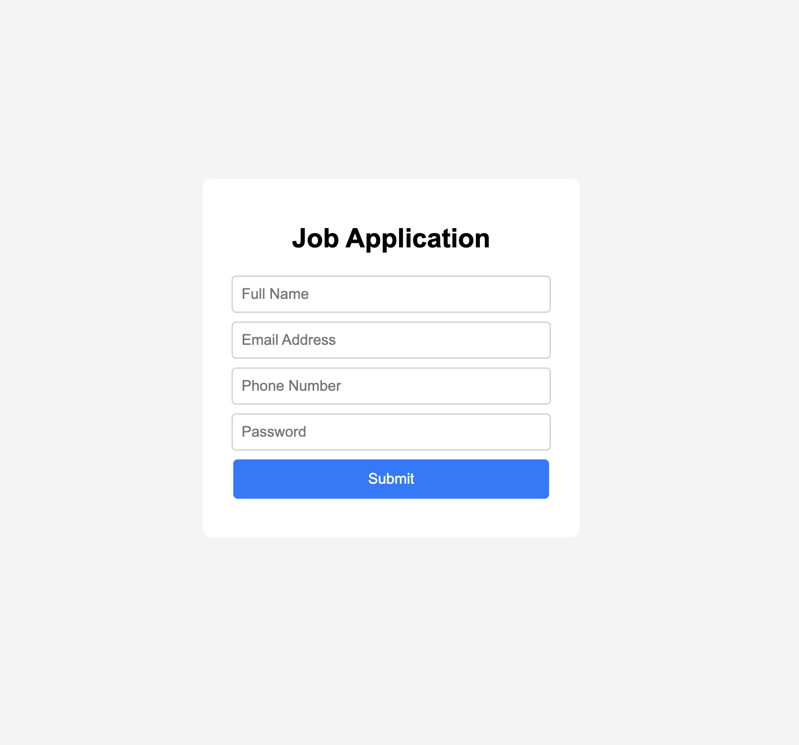

# Job Application Form Validation

**Live Demo**  
https://ananyagpt1105.github.io/job-application-form-validation/

## Preview

## About the Project
This project is a job application form that validates user input before submission. It checks for valid name format, email format, phone number length, and password strength using JavaScript regular expressions.

## Features
- Input validation for name, email, phone, and password
- Error messages for invalid inputs
- Success message when all fields are valid
- Responsive centered form layout

## Technologies Used
- HTML
- CSS
- JavaScript

## Concepts Practiced
- Form validation
- Regular expressions
- DOM manipulation
- Dynamic message display
